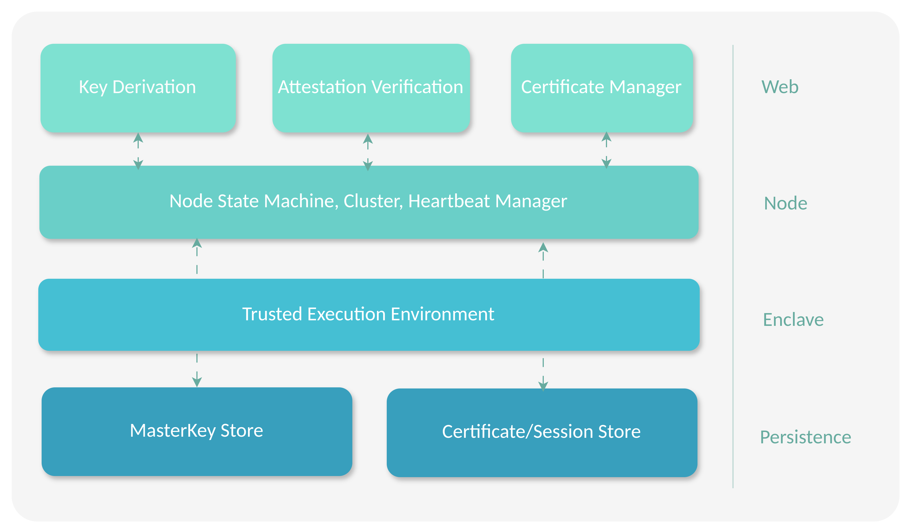

# Betterkey - Trusted Key Derivation and Attestation Verification Service

Betterkey provides a secure, distributed infrastructure for cryptographic key derivation and management. The system uses hardware-backed attestation (Intel® SGX) to establish trust between cluster nodes and securely distribute a cluster-wide master key, which serves as the root secret for all subsequent key derivation for Confidential VMs.



## Key Features

- **Hardware-Backed Trust**: Intel® SGX/TDX remote attestation embedded in TLS
- **Distributed Consensus**: Automatic cluster formation with no single point of failure
- **Secure Key Management**: Master key sealed to enclave identity and distributed via attested channels
- **High Availability**: Gossip-based failure detection with automatic key sharing
- **RESTful API**: HTTPS endpoints for key derivation and attestation verification of nodes

For detailed documentation, see **[Betterkey Architecture](doc/01-Internals.md)**.

## Build & Test

* Export paths for signing key and enclave properties. Example configuration can be found under `dev/conf` directory.

```
export SIGNERKEY=/path/to/signer.pem
export ENCLAVE_PROPS=/path/to/enclave.properties
```

* Build with Docker

```
docker build -t bootstrap .
```

### Test

* Example all-in-one server cluster with 3 seed nodes and a valkey server 

```
docker-compose -f dev/docker-compose-allinone.yml up
```

## Built on

Betterkey is built using the following projects

* [Ego](https://github.com/edgelesssys/ego) framework for building SGX enclaves
* [Memberlist](github.com/hashicorp/memberlist) for clustering
* [Certmagic](github.com/caddyserver/certmagic)
* [Valkey-go](github.com/valkey-io/valkey-go)
* [Testify](github.com/stretchr/testify)
* [Go-chi](github.com/go-chi/chi)
* [Testcontainers-go](github.com/testcontainers/testcontainers-go)


## License

MIT License Copyright (c) 2025 real-cis GmbH