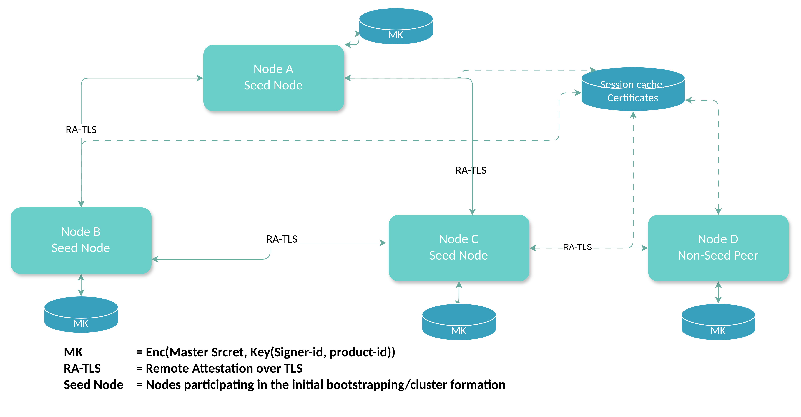
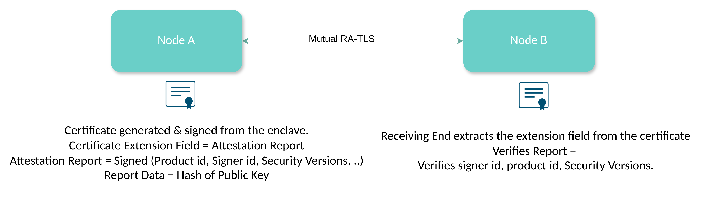

## Architecture

Betterkey operates as a mesh of nodes that:

1. **Form a cluster** using HashiCorp Memberlist (gossip protocol)
2. **Attest each other** via TDX/SGX quotes embedded in TLS certificates
3. **Derive a master key** through distributed consensus (seed nodes)
4. **Share the key** securely with new joining nodes
5. **Provide key derivation** through HTTPS API endpoints

### Cluster convergence

Nodes discover each other using **Memberlist** (Gossip protocol):

- Seed nodes bootstrap the cluster by connecting to configured peer addresses
- New nodes join by contacting an existing cluster member configured as peer
- Failure detection happens automatically via heartbeat gossip
- Network partitions are detected through heartbeat verification failures

Each node maintains its state (`NO_KEY`, `SEEDING`, `VALIDATING`, `QUERY_KEY`, `READY`) and broadcasts it in cluster metadata.

### Mutual Attestation

 

All node-to-node communication uses **transparent attested TLS**:

#### Certificate Generation

- Each node generates a keypair
- Hashes the public key and requests TDX/SGX quote with hash as report data
- Embeds the hardware quote in X.509 certificate extension

#### Peer Verification

- Extract quote from peer certificate
- Verify quote signature against Intel root of trust
- Validate quote binds to certificate's public key
- Check enclave properties (ProductID, SignerID, SecurityVersion, Debug flag)

This ensures that **only authorized enclaves** with matching identities can join the cluster.

### Master Key 

The **cluster master key** is the root secret for all key operations.

#### Initial cluster

When a Betterkey cluster starts for the very first time, the configured seed nodes collaborate to create a shared master key. They first elect a “master seed” by sorting their node names and picking the first one. This master seed generates a fresh 32‑byte random value that becomes the cluster master key. It sends this key to the other seed nodes over mutually attested TLS connections. To add redundancy and detect inconsistencies, the non‑master seed nodes also forward the same key to each other in a gossip‑style fashion. Once every seed node has received and confirmed the same key, each one seals it to disk using SGX (binding it to that CPU and enclave identity) and moves into the `READY` state.

#### Joining an existing cluster

When a new node wants to join a cluster that already has a master key, it does not participate in seeding. Instead, it enters the `QUERY_KEY` state and looks for any peer already in the `READY` state. The joining node sends a key request to such a peer over the attested TLS channel. The READY peer responds by sending the existing master key, again over this secure channel. After receiving the key, the new node immediately seals it to its local disk using its own enclave, then validates that the operation succeeded and moves itself into the `READY` state.

#### Node restart

If a node restarts and finds a sealed master key file on disk, it must verify that this key still matches the rest of the cluster. The node first unseals the master key and then performs a challenge‑response protocol with a READY peer. It sends its own node ID as a challenge. The peer encrypts this ID using the cluster master key and returns the result. The restarting node then tries to decrypt the response using its local master key; if decryption succeeds and the original node ID is recovered, it proves that the local key matches the cluster’s key. At that point, the node safely transitions back into the `READY` state.

### Heartbeat

Nodes prove **liveness and key possession** via cryptographic heartbeats:

- Every 15 seconds, each `READY` node generates a random nonce
- Node signs nonce with master key
- Heartbeat (nonce + signature) is broadcast in node metadata
- Peers verify signatures; mismatches indicate split-brain or rogue nodes

Heartbeat statistics are aggregated into 2-minute windows and exposed to application logic via `StateListener`.

### Key Storage & Encryption

**Local Storage (Master Key):**

- Stored in local filesystem as encrypted file for each node
- Encrypted using SGX - only this enclave on this CPU can decrypt

**Distributed Storage:**

- Valkey key-value store for certificate and session id store.
- All data encrypted with master key before storage

#### Key Migration 

* Keys are derived based on the node's enclave identity and the master key.
* A TDX VM using the key derivation service can continue to derive the keys as long as at least a single node is serving the key derivation requests. 
* A migration might be necessary and is feasible if in the event that no nodes are remaining and a user wishes to host their own Betterkey nodes.

### Web Service & Key Derivation

The HTTP API server starts only after the node reaches `READY` state.

#### TLS Configuration

* Uses ACME (Let's Encrypt) if `ACME_DNS_API_TOKEN` is configured
* Falls back to node's attested TLS certificate otherwise
* ACME generated keypair is persisted on valkey store sealed with the masterkey.

#### Key Derivation Endpoints

* Key derivation, at the moment, is enabled for TDX VMs, and the requesting client must pass an attestation challenge
    - Key derivation service generates a nonce and session id, and send these as an attestation challenge to the requesting client.
    - The client, upon receiving the nonce, generates a TD Report with nonce as the Report Data, and sends the signed quote back to key derivation service.
    - Key derivation service validates the nonce and quote, then derives a key seed from both MRTD and CFV measurements.

#### Key Derivation Flow

1. Client submits TDX quote, eventlog data
2. Server verifies quote/event log and extracts MRTD, CFV from Eventlog
3. Server derives a seed from `SHA256(MRTD || CFV)`, then derives key material via HKDF
4. The derived key is sent to the client in response
